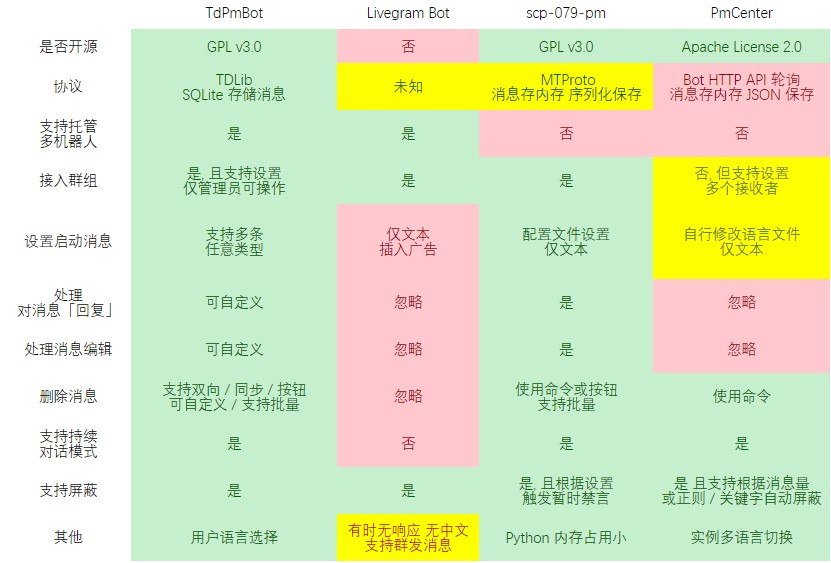

# TdPmBot



## 安装

#### 依赖 (Linux)

```shell script
apt install -y openssl git zlib1g libc++-dev default-jdk
```

注： 仅支持 `amd64, i386, arm64`, 否则需自行编译 [LibTDJni](https://github.com/TdBotProject/LibTDJni) 放置在 libs 文件夹下.  

如遇到找不到 LIBC 库, 请更新系统或编译安装.

### 依赖 (Windows)

需要安装 [Git for Windows](https://gitforwindows.org/) 与 [VC++ 2015](https://github.com/abbodi1406/vcredist/releasesvc) 与 OpenJDK 11

您也可使用 `vcpkg` 编译安装 `openssl` 与 `zlib`

## 配置

复制 `_pm.conf` 到 `pm.conf`

```
BOT_LANG: 工作语言, 暂仅支持 `zh_CN`, `en_US`.
BOT_TOKEN: 机器人令牌.
PUBLIC: 是否以公开模式运行.
ADMIN: 管理员ID.
LOG_LEVEL: 日志等级, 默认为 INFO.
```

### 其他
```
SERVICE_NAME: systemd 服务名称, 默认 `td-pm`, 修改如果您需要多个实例.
MVN_ARGS: Maven 编译参数.
JAVA_ARGS: JVM 启动参数.
ARGS: 启动参数.
```

若您不知道账号ID, 可留空, 启动后发送 /id 到机器人获取.

`BINLOG`: 指定 UserBot 的 binlog, 跳过交互式认证. ( 仅用于环境变量 )

## 管理

`./bot.sh run` 编译安装并进入交互式认证  
`./bot.sh init` 注册 systemd 服务  
`./bot.sh <start/stop/restart>` 启动停止  
`./bot.sh <enable/disable>` 启用禁用 (开机启动)  
`./bot.sh rebuild` 重新编译  
`./bot.sh update` 更新  
`./bot.sh upgrade` 更新并重启服务  
`./bot.sh log` 实时日志  
`./bot.sh logs` 所有日志

## 迁移

`./bot.sh run --backup [fileName 可选]`

备份所有迁移需要的文件到 tar.xz 包, 解压即可覆盖数据.

注: 建议迁移后手动运行 `/gc` 命令拉取消息记录.

## Docker

```
docker run -d --name td-pm \
  -v <数据目录>:/root/data \
  -e BOT_TOKEN=<机器人令牌> \
  -e ADMIN=<管理员ID> \
  -e PUBLIC=true \
  docker.pkg.github.com/tdbotproject/tdpmbot/td-pm

docker logs td-pm -f -t
```

注: 需要使用 Github 账号登录 

`docker login docker.pkg.github.com -u <您的 Github 用户名> -p <您的 Github AccessToken>`

## 使用

查看BOT内提示

## TODOs

* 照片组支持
* 支持添加命令
* 管理员命令